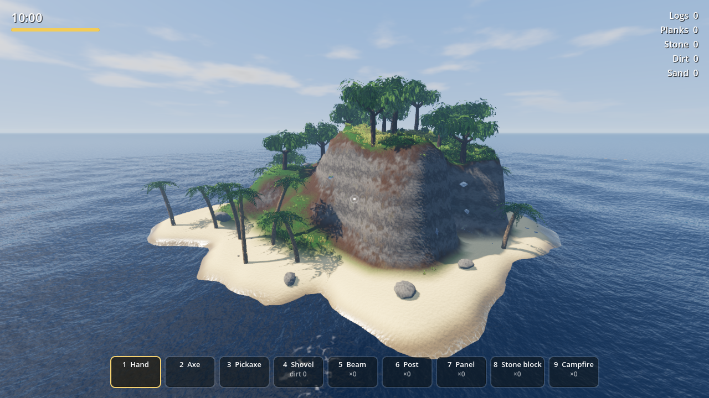
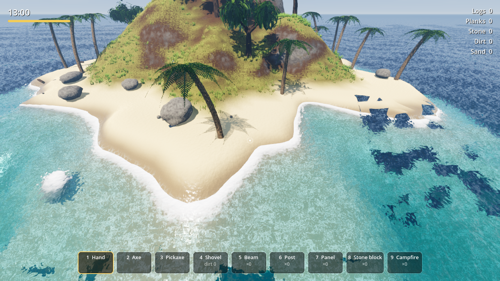
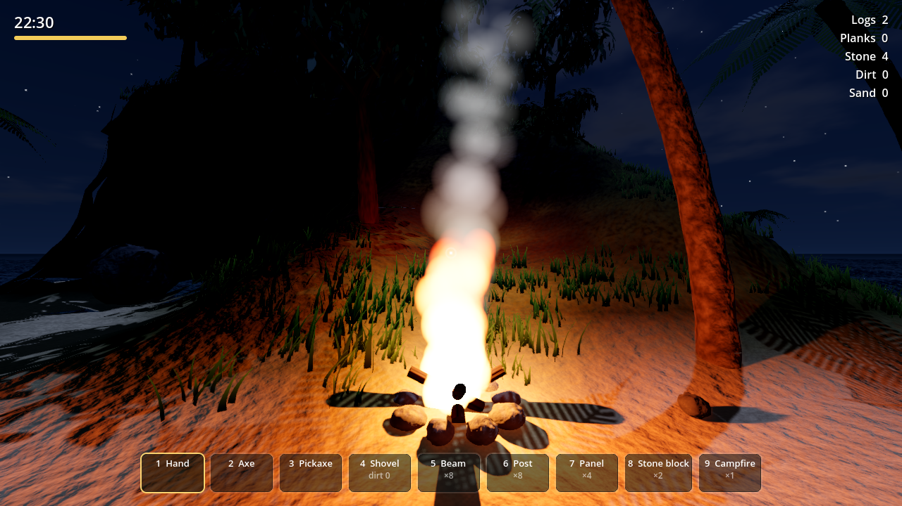

# Jazira — جزيرة

A tiny, physically simulated sandbox island in the spirit of Minecraft — **without the cubes**.
Built with **Godot 4.4** (Forward+ renderer, Jolt physics). Everything (terrain, trees, rocks,
textures, sounds) is generated procedurally in code. There are no external asset files.



| | |
|---|---|
|  |  |

---

## بالعربي

لعبة فكرتها زي ماين كرافت: تحفر وتقطع شجر وتبني. لكن العالم **ناعم وحقيقي**، مش مربعات، وعلى جزيرة استوائية صغيرة جداً.

**المميزات:**
- **أرض قابلة للحفر والبناء بالكامل** (Smooth Voxel Terrain بخوارزمية Surface Nets). تقدر تحفر في الرمل أو التراب أو تكسر الصخر بالمعول، وتردم بالتراب اللي جمعته. فيه كمان جُرف بحري وكهف.
- **فيزياء حقيقية (Jolt)**: كل حاجة ليها كتلة حقيقية. الأشجار لما تتقطع **بتقع فعلاً** وبعدين تتقسم لجذوع. الخشب **بيطفو** على الموج والحجارة **بتغرق**. الصخور بتتدحرج لو حفرت تحتها.
- **شيل الحاجات بإيدك**: القوة بتتطبق من النقطة اللي ماسكها منها، فالحاجة الخفيفة بتترفع والتقيلة بتتجر على الأرض.
- **بناء بسلامة إنشائية**: الأعمدة والكمرات والألواح والطوب الحجري بتاخد الدعم من الأرض. لو شلت العمود، أو طلعت بالبناء لبرّه بزيادة من غير سند، **المبنى بيقع**.
- **محيط واقعي**: موج Gerstner، وانكسار الضوء، والمياه الضحلة الفيروزي، والرغوة على الشط، والـ caustics تحت الماء، وتقدر تعوم وتغطس.
- **دورة ليل ونهار**: شروق وغروب ونجوم وقمر وسحب، وضباب حجمي، ونار مخيم بتنوّر بالليل.
- **أصوات متولّدة بالكود بنمذجة فيزيائية**: موج بيتكسر على الشط، هوا بيهب، مطر، رعد، خطوات بتختلف حسب الأرضية، عصافير ونوارس وصراصير.
- **شخصية إنسان واقعية** (Microsoft Rocketbox — رخصة MIT، مسموح تجارياً) بحركات Motion Capture حقيقية.
- **القصة (الفصل الأول)**: السفينة «المرجان» بتغرق في عاصفة بالليل، وتصحى على الشط قدام حطامها.
  كل لعبة جديدة بتختار **مين انت** (مهندس / متسلل / طبيب) و**ليه السفينة غرقت** (سلاح مهرّب / بنت مفقودة / طريق ملعون)،
  والأحداث والرسايل والنهاية بتتغير على حسب ده وعلى حسب اختياراتك. فيه **حالة نفسية**: الوحدة والضلمة والجوع بيكسروك،
  ولو نزلت أوي هتبدأ تشوف وتسمع حاجات مش موجودة.

### إزاي تلعب
**الطريقة الأسهل:** نزّل ملف `Jazira.exe` الجاهز من تبويب **Actions** في GitHub (آخر build ← Artifacts ← `Jazira-Windows`) وشغّله على طول.

**أو من السورس:**
1. نزّل [Godot 4.4](https://godotengine.org/download) (النسخة العادية، مش .NET).
2. افتح Godot ← Import ← اختار ملف `project.godot` من الفولدر ده.
3. اضغط **F5**.

### التحكم
| الزرار | الوظيفة |
|---|---|
| WASD / Shift / Space | حركة / جري / نط وعوم لفوق |
| Ctrl | غطس |
| عجلة الماوس أو 1–9 | اختيار الأداة |
| E | التقاط حاجة |
| **اليد**: اضغط LMB مطوّل | شيل الحاجات، وRMB ترميها |
| **الفأس** | قطع الشجر وفك الخشب |
| **المعول** | تكسير الصخور والصخر |
| **الجاروف** | LMB حفر، RMB ردم |
| **البناء** | LMB تحط القطعة، R/Q تلف، F تميّل، G تشغّل/تقفل الـ snap |
| **نار المخيم** | 2 جذع + 4 حجارة |
| T مطوّل | تسريع الوقت |
| Tab | الاحتياجات والصناعة — و**اليوميات** (Journal) |
| E | فتح صندوق / قراءة رسالة في زجاجة / التعامل مع النورس |
| Esc | القائمة والإعدادات (فيها وضع Performance ولغة القصة عربي/إنجليزي) |

> الجذوع بتتحول لألواح أوتوماتيك (جذع واحد = 4 ألواح).

---

## English

**Run:** download `Jazira.exe` from the latest GitHub Actions run (Artifacts → `Jazira-Windows`),
or open `project.godot` in Godot 4.4+ and press F5.

### Features
- **Smooth, fully editable voxel terrain** (Surface Nets, multithreaded meshing) — dig, fill, mine; beaches, sea cliff, a cave.
- **Rigid-body physics everywhere (Jolt)** with real masses: felled trees topple then split into logs, wood floats on the actual wave field while stones sink, boulders roll when undermined.
- **Physical grabbing**: forces are applied at the grip point with a force cap, so light objects lift and heavy ones drag.
- **Structural integrity building**: beams, posts, panels, stone blocks draw support from the ground; cantilevers lose support per link and collapse into dynamic debris when unsupported.
- **Ocean**: Gerstner waves (CPU-matched for buoyancy and swimming), depth-based absorption and refraction, shore foam, underwater caustics and post-effect.
- **Atmosphere**: custom sky shader (sun, moon, stars, moving clouds), full day/night cycle, volumetric fog, SSAO/SSIL, a campfire with flickering shadowed light.
- **Procedural audio**: surf, wind, birds, crickets, and every impact and footstep are synthesized at runtime.

### Project layout
```
scripts/core     game state (autoload), boot, procedural materials, particles, synthesized audio
scripts/world    voxel terrain + chunks, ocean, day/night
scripts/objects  physics items, boulders, trees, structures + support solver, campfire
scripts/player   first-person controller, tools, building
scripts/ui       HUD, pause menu
shaders          terrain (triplanar), ocean, sky, grass, leaves, underwater
```

### Phase 1 (foundation)
- Graphics presets Low / Medium / High / Ultra, auto-detected on first launch, plus render scale (FSR upscaling)
- Custom splash and loading screen, main menu (Continue / New Game / Settings / Quit)
- Settings saved to `user://settings.cfg`; whole-world saves in `user://saves/slot1.sav` with autosave every 4 minutes
- See [ROADMAP.md](ROADMAP.md) for all phases

### Phase 2 (survival)
Needs (health, food, water, energy, body temperature, wetness), coconuts / berries / spear fishing / cooking,
rain collectors, beds & sleep, crafting (Tab) with tool durability and carry weight, dynamic weather with
storms that raise the waves, and a third-person view (V).

### Dev helpers
```
godot --headless -- --test                     # gameplay self-test (chop, float, dig, build, collapse), then saves
godot --headless -- --loadtest                 # loads that save and prints the same world summary
godot -- --shot=out.png --hour=17.5 [--pose=x,y,z,yaw,pitch]   # render a screenshot
```

> Note: MSAA is intentionally disabled (FXAA is used instead) because it breaks the depth
> texture the water refraction depends on.
